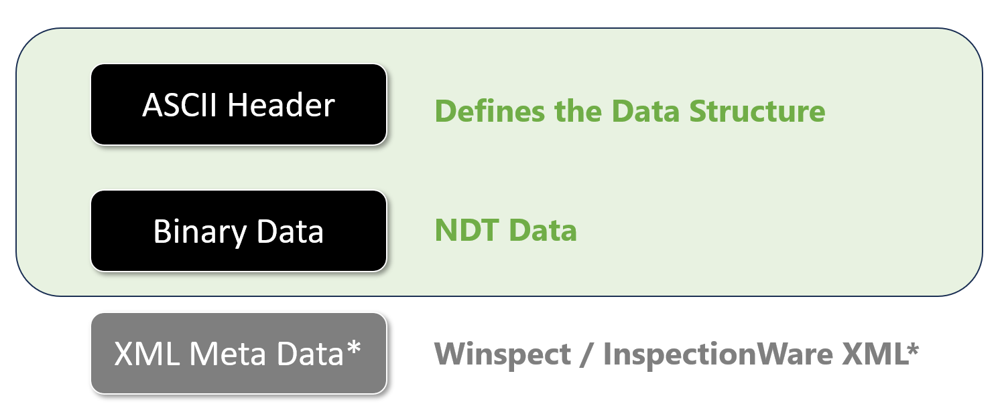

# Welcome to SDT file format

SDT defines how ultrasonic and inspection signals are formatted and stored, ensuring consistent and precise representation of waveform data for analysis in NDE applications.

<figure markdown>
<figcaption>SDT Data File Structure</figcaption>
{ width="800" }
</figure>
